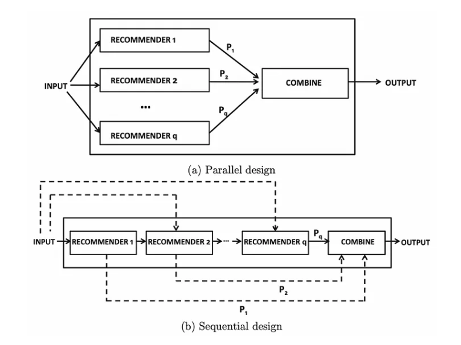

# Book Recommendation System

Recommendation engines are a subclass of machine learning which generally deal with ranking or rating products / users. Loosely defined, a recommender system is a system which predicts ratings a user might give to a specific item. These predictions will then be ranked and returned back to the user.
Exploring recommendation systems through Books and Python

I have created this repository to build a Hybrid Recommendation System

Hybrid recommendation systems have two predominant designs, parallel and sequential. The parallel design provides the input to multiple recommendation systems, each of those recommendations are combined to generate one output. The sequential design provides the input parameters to a single recommendation engine, the output is passed on to the following recommender in a sequence. 

### a) Collaborative Filtering System  
This recommends items based on similarity measures between users and/or items. The basic assumption behind the algorithm is that users with similar interests have common preferences.

### b) Content Based Filtering System  
It is supervised machine learning used to induce a classifier to discriminate between interesting and uninteresting items for the user.
